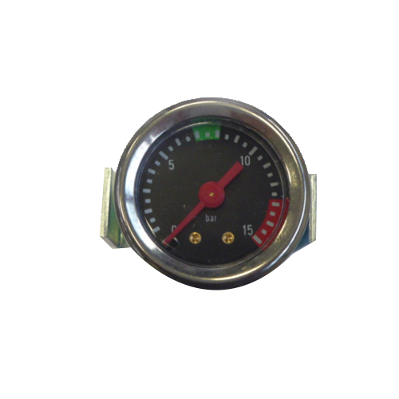

# 커피학개론
## 에티오피아의 옛 이름으로 옳은것은? 2. 아비시니아
- 아라비아
- 아비시니아
- 카와
- 카베

## 커피의 애음 풍습으로 터키에 들어온 것은 다음 중 어느 때인가? 1. 세림1세
- 세림 1세
- 요한렛 6세
- 무라트 1세
- 메흐메트 6세

## 1687년 군인이었던 게오르그 콜스치스키가 커피하우스를 연 곳은 어디인가? 3. 비엔나
- 런더
- 바르셀로나
- 비엔나
- 부다페스트

## 다음은 각 국의 커피 문화에 대한 특징을 설명한 것이다. 틀린것은? 3. 러시아 온도가 낮아 커피 재배 X
- 아랍 - 커피를 마시기 전에 절을 하고 상대를 존중한다는 표현으로 예절과 법도를 중시한다.
- 오스트리아 - 블랙이면 모카, 밀크라면 브루넷이라고 불리는 아인슈패너가 대표적 메뉴이며 음작적 여유와 아름다움을 반영한다.
- 러시아 - 커피의 원산지로 생두를 주석 냄비에 볶아 나무절구로 곱게 빻아 커피를 마신다.
- 프랑스 - 에스프레소에 신선한 스팀 우유를 살짝 얹은 부드러운 거품의 카페오레가 대표적인 메뉴이다.

## 뜨거운 물속에 흑설탕을 끓여 녹인 뒤, 불은 끄고 커피 카루를 넣고 저은 후 가루가 모두 가라앉을 때까지 5분정도 두었다가 상부의 맑은 커피만을 마시는 틴토가 유명한 나라는? 1. 콜롬비아(흑설탕)
- 콜롬비아
- 러시아
- 그리스
- 이탈리아

## 다음은 커피열매의 구조를 설명한 것이다. 틀린 것은? 3. 파치먼트 (외과피(껍질), 펄프(과육)을 제거한 상태. 한마디로 과일만 먹고 씨 뱉아 놓은 꼴.)
- 점액질 - 2mm 두꼐의 미끈미끈한 점액 부분
- 펄프 - 생두 가운데 나 있는 흠
- 파치먼트 - 생두를 감싸고 있는 껍질
- 은피 - 생두에 부착되어 있는 얇은 막

## 세계에서 생산되는 원두의 약 70%를 차지하고 있으며, 일반적으로 가장 많이 소비되는 품종은 무엇인가? 3. 아라비카
- 로부스타
- 리베리카
- 아라비카
- 아라부스타

## 다음은 로부스타 품종에 대한 특징을 설명한 것이다. 틀린 것은? 2. 700m 이하
- 쓴맛이 강하고 가격이 아라비카에 비해 저렴한 편이다.
- 해발 500~1500m 정도의 고지대에서 주로 생산되고 있다.
- 불룩하고 둥근 형태의 모양이다.
- 인도, 아프리카, 인도네이사 지역에서 주로 로부스타 커피를 생산한다.

## 다음 중 아라비카 품종에 해당하지 않는 것은? 4. S274 
- 문도 노보
- 카투 아이
- 버번
- S274
- 참고: https://m.blog.naver.com/suck09/220333085528

## 브라질에서 발견된 버번과 수마트라의 자연교배종이며 카투라, 카투아이와 함께 브라질의 주력 상품의 품종 이름은 무엇인가? 2. 문도노보
- 버번
- 문도노보
- 티모르
- 마라고지페

## 다음은 버번 품종에 관란 설명이다. 틀린 것은? 3. 교배종이 아니다.
- 티피카의 돌연변이 종이다.
- 생두는 상대적으로 작고, 둥근 모양으로 단단한 편이다.
- 브라질에서 발견된 문도 노보와 카투라의 교배종이다.
- 재배의 적정고도는 1,000m ~ 2000m로 고지대에 적합하다.

## 다음은 아라비카 품종에 관한 설명이다. 틀린 것은? 1. 로부스타 특징
- 대체적으로 쓴맛이 강한 편이다. 
- 세계적으로 전체 생산량의 약 70%를 차지하고 있다.
- 에티오피아가 원산지이다.
- 평균기온 20도씨 해발 500m~2000m의 고지대에서 재배된다.

## 인도 고유의 품종으로서 생산성이 높으며 병충해에 강한 아라비카종은 무엇인가? 3. 켄트
- 카투아이
- 마라고지페
- 켄트
- 게이샤

## 커피의 주요 산지 중 아프리카 나라에 해당하지 않는 것은? 1. 인도네시아
- 인도네시아
- 에티오피아
- 케냐
- 탄자니아

## 다음은 티피카 품종에 관한 설명이다. 틀린것은? 2. 버번이 티피카의 돌연변이 품종이다.(말장난 주어 목적어 교체)
- 아라비카 원종에 가장 가까운 품종이다
- 버번의 돌연병이 종으로 커피의 녹병에 강하다.
- 생두는 긴 편으로 좋은 향과 신맛이 특징적이다.
- 블루마운틴, 하와이 코나가 대표적인 품종이다.

## 다음은 커피의 주요 산지 중 멕시코에 관한 설명이다. 틀린 것은? 4. 낮은 가격 품질 우수 미국 거래
- 아라비카종과 로부스타 종이 모두 생산되며 아라비카 생산량은 세계 3위이다.
- 고지대에서 생산된 알투라 커피가 최고등급 커피이다.
- 북미 자유무역협정으로 미국과의 교역이 활발해짐으로서 상대적으로 낮은 가격으로 품질이 우수한 커피로 각광 받고 있다.
- 생산량의 90% 이상을 일본으로 수입해가는 독점구매 정책과 엄격한 생산량 제한, 품질관리를 통하여 상품의 희소성을 높은 가격으로 거래되고 있다.

## 다음 중 커피의 주요 산지 중 중남미 나라에 해당하지 않는 것은? 4. 브룬디(지리)
- 콜롬비아
- 코스타리카
- 브라질
- 브룬디

## 다음은 품종개량의 목적에 관한 설명이다. 틀린 것은? 3. 꽃이냐?
- 환경 적응성
- 조기수확
- 외견적 미우수성
- 다량의 수확

## 커피의 재배과정에서 묘판을 만들어 커피 종자를 뿌리고 싹이 나오는 기간은? 4. 40일 이상
- 10 ~ 20일
- 20 ~ 30일
- 30 ~ 40일
- 40일 이상

## 국가별 커피수확 시기를 나열한 것이다. 옳은 것은? 1. 에티오피아 11월 ~ 2월
- 에티오피아 11월 ~ 2월
- 코스타리카 3월 ~ 5월
- 과테말라 5월 ~ 8월
- 브라질 12월 ~ 3월
- 참고: https://m.blog.naver.com/PostView.naver?isHttpsRedirect=true&blogId=eogusdk890&logNo=70137132975

## 다음 중 커피 수확의 방법으로 틀린 것은? 2. 펄프드 내추럴(가공방식)
- 핸드 피킹
- 펄프드 내추럴
- 기계 수확
- 스트리핑
- https://m.blog.naver.com/PostView.naver?isHttpsRedirect=true&blogId=ctable&logNo=220818067727

## 다음 중 커피 건조 방식에 해당하지 않는 것은? 1. 스트리핑(수확방식)
- 스트리핑
- 파티오
- 온실건조
- 기계건조
- https://bwissue.com/coffeestory/173306

## 다음은 습식 가공 방식에 관한 설명으로 바른 것은? 3. 아라비카 등 대체적으로 품질이 높고 균일한 생두를 수확하는 방식이다.
- 브라질, 에티오피아, 인도네시아 등 로부스타 생산국에서 주로 재배된다.
- 생산단가가 저렴하고 친환경적인 재배 환경에서 생산된다.
- 대체적으로 품질이 높고 균일한 생두를 수확하는 방식이다.
- 강한 바디감과 단맛이 좋은 특성을 지니고 있다.
- https://m.blog.naver.com/pcs_0805/221962322608

## 가공과정에서 과육을 10%~20%만 남겨두고 피치먼트가 거의 보이게 하는 방식은? 2. 옐로우 허니
- 레드허니 
- 옐로우허니
- 펄프드 내추럴
- 블랙허니
- https://coffee4m.com/%EC%BB%A4%ED%94%BC%EA%B0%80%EA%B3%B5-%ED%97%88%EB%8B%88%ED%94%84%EB%A1%9C%EC%84%B8%EC%8A%A4/

## 습식법의 가공 순서로 올바르게 나열된 것은? 1. 과육제거 - 발효 - 세척 - 건조
- 과육제거 - 발효 - 세척 - 건조
- 발효 - 과육제거 - 세척 - 건조
- 과육제거 - 세척 - 발효 - 건조
- 발효 - 세척 - 과육제거 - 건조

## 건식법과 습식법에 대한 설명 중 틀린 것은? 2. 습식법 특징
- 건식법은 생산단가가 저렴하고 친환경적이다.
- 품일이 좋고 균일한 방식은 건식법이다.
- 신맛이 건식법 보다 습식법이 더욱 좋다.
- 품질이 높고 균일한 가공방식은 습식법이다.

## 다음은 커피의 주요 산지 중 과테말라에 관한 설명이다. 틀린 것은? 2. 스모크 커피의 대명사이다.
- 비옥한 화산재 토양에서 고급 커피를 생산하는 나라이다.
- 세계 제 2위의 커피 생산국으로 마일드한 커피의 대명사로 불리운다.
- 그늘 경작법으로 재배되며 스모크 커피의 대명사라는 특징을 가지고 있다.
- 경작 고도에 따라 7등급으로 나뉘며 해발고도 1,370m 이상에서 경작되어지는 것을 최고등급으로 불리운다.

## 콜롬비아의 경우 생두의 크기에 의해 분류가 되는데 스크린 사이즈17 이상에 해당되는 것은 무엇인가? 4. 수프리모
- 엑셀소
- 엑스트라
- 커머셜
- 수프리모
- http://cafedecolombia.kr/colombia/coffee-grade/

## 다음은 로스팅 단계 중 시나몬 로스팅 강도에 관한 설명이다. 틀린 것은? 1. 시티 로스팅이다.
- 아메리칸 로스트로 불리며 신맛과 쓴맛을 적절하게 느낄 수 있다.
- 생두의 외피로부터 은피가 가장 많이 제거되는 단계이다.
- 원두의 색상은 주로 황갈색을 띤다.
- 커피의 신맛이 가장 두드러지는 단계이다.
- http://baristarules.maeil.com/blog/2952/

## 다음은 로스팅 과정의 물리적 화학적 변화에 관한 설명이다. 틀린 것은? 3. 로부스타가 카페인 함량이 높다.
- 수분함량은 로스팅을 하면 10~20%에서  로스팅 정도에 따라 1~5%까지 줄어든다.
- 단백질은 원두의 향기 형성에 중요한 역활을 한다.
- 카페인은 아라비카 종이 로부스타 종에 비해 두 배 가까이 함유되어 있다.
- 가용성 성분은 원두를 분쇄하여 뜨거운 물로 추출하였을 때 나오는 성분이 많을수록 맛과 향이 진하다.
- http://baristarules.maeil.com/blog/2551/

## 커피를 처음 로스팅 하기 시작한 것은 언제인가? 2. 12~13세기
- 6~7세기
- 12~13세기
- 15~16세기
- 17세기 이후

## 로스팅 머신의 가열 방식 중에서 드럼표면의 열과 후면에 뚫린 통풍구로 열풍을 전달하는 방식은 무엇인가? 2. 반열풍식
- 반열풍식
- 열풍식
- 직화식
- 유동식
- https://coffeebobceo.tistory.com/9

## 로스팅 중에 사용되는 3가지 열전달 현상이 아닌 것은? 4. 직화열은 쓰이지 않는다.
- 복사열
- 전도열
- 대류열
- 직화열
- https://awhitechicken.com/entry/%EB%A1%9C%EC%8A%A4%ED%84%B0%EC%9D%98-%EC%97%B4%EC%9B%90%EA%B3%BC-%EC%97%B4%EC%A0%84%EB%8B%AC-%EB%B0%A9%EC%8B%9D

## 로스팅 포인트중에서 가장 강하게 볶는 단계를 무엇이라고 하는가? 3. 이탈리안
- 미디움
- 이탈리안
- 프렌치
- 시티

## 다음은 로스팅 과정의 물리적 화학적 변화 중 갈변 반응에 대한 설명에 해당하지 않는 것은? 3. 산화 반응
- 마이아르 반응
- 클로로겐산 반응
- 산화 반응
- 캐러멜화 반응
- https://m.blog.naver.com/gyncoffee/221705983170

## 다음은 혼합 블렌딩에 관한 설명이다. 틀린 것은? 3. 혼합하여 로스팅하는 방식이 블렌딩이다.
- 기호에 따라 미리 정해 놓은 생두를 혼합하는 방식이다.
- 로스팅 된 커피의 색이 균형적이다.
- 각각의 생두를 로스팅하여 블렌딩하는 방식이다.
- 한꺼번에 로스팅을 함으로써 시간이 단축되는 효과가 있다.

## 블렌딩에서 사용되는 원두의 가짓수는 몇 개가 적당한가? 2. 3~5가지
- 2가지
- 3~5가지
- 5~7가지
- 7가지 이상

## 다음은 커피 평가시 결점에 관한 설명이다. 틀린 것은? 4. 있는 것을 의미한다.
- 커피의 퀄리티를 떨어뜨리는 부정적이거나 나쁜 향미를 의미한다.
- 결함은 흔히 맛 측면에서 압도적이거나 샘플을 맛없게 만드는 경우이다.
- 시큼한, 고무냄새 기술어로 표현한다.
- 마시는 첫 순간부터 마지막 삼키거나 뱉어내기까지의 총체적인 여운에 이르기까지 부정적인 인상이 없어지는 것을 의미한다.
- https://synapseinfo.tistory.com/101

## 다음은 커핑의 평가 항목을 설명한 것이다. 틀린 것은? 4. 커피에 물을 부었을때 나는 커피의 향이다.
- 미각 - 혀를 덮고 있는 점막의 수용체가 가용성 화합물로 이루어진 자극에 반응하여 느끼는 맛에 대한 감각을 평가하는 항목이다.
- 촉각 - 혀와 입안에 있는 말초신경 조직에서 물리적으로 느껴지는 촉감으로 밀도, 점도, 표면 장력과 물리, 화학적 특성을 평가하는 항목이다.
- 드라이 아로마 - 분쇄된 커피에서 나오는 향기를 평가하는 항목이다.
- 웻 아로마 - 커피를 마신 후에도 입안에 남아있는 맛과 향을 평가하는 항목이다.
- https://bwissue.com/coffeetopics/573384

## 커핑 점수를 개별적으로 체크할 시 해당하지 않는 요소는? 1. 그린 빈
- 그린 빈
- 클린 컵
- 바디
- 밸런스

## 혀와 입천장 사이에 감지되는 커피액의 촉감을 판단하는 커핑 항목은 무엇인가? 1. 바디
- 바디
- 클린컵
- 단맛
- 밸런스

## 다음은 커피가 인체에 미치는 긍정적인 효과에 관한 설명이다. 틀린 것은? 4. 맞는 문장이지만 부정적 효과에 해당한다. 곧 내성이 생겨 고혈합에 이르지는 않는다.
- 각성효과 및 피로 회복에 효과가 있다.
- 담석 결정체가 생성되는 것을 감소시킨다.
- 체지방의 분해를 증가시켜 일의 지속성을 향상시킨다.
- 혈관 확장 및 혈류량의 증가를 유도하여 일시적인 혈압 상승을 일으킨다.

## 음료의 카페인 함유량을 나열한 것이다. 가장 카페인 함유량이 많은 것은? 1. 드립방식
- 드립방식
- 에스프레소
- 인스턴트 커피
- 코코아

## 짧은 시간에 많은 양의 커피를 마시게 되면 카페인 중독, 카페인 의존증을 일으키는데 이를 캐피니즘이라고 한다. 이 경우 나타나는 증상이 아닌것은? 2. 발열
- 불안
- 발열
- 설사
- 두통
- https://wlgp1765.tistory.com/entry/%EC%BB%A4%ED%94%BC%EC%97%90-%EB%8C%80%ED%95%9C-%EC%98%A4%ED%95%B4%EC%99%80-%EC%A7%84%EC%8B%A4

## 디카페인 커피 제조 방법으로 해당하지 않는 것은? 1. 갈변반응
- 갈변반응
- 용매추출법
- 물추출법
- 초임계추출법
- https://coffee4m.com/%EB%94%94%EC%B9%B4%ED%8E%98%EC%9D%B8-%EC%BB%A4%ED%94%BC-%EC%A0%9C%EC%A1%B0%EA%B3%B5%EC%A0%95/

## 디카페인 커피의 국제기준에 적합한 카페인 추출양은 어느 것인가? 4. 97%
- 37%
- 57%
- 77%
- 97%

## 원두의 신선도를 장시간 지속시키는 커피의 포장기법에 관한 설명이다. 해당하지 않는 것은? 4. 냉동포장
- 밸브 포장
- 질소 포장
- 원웨이 포장
- 냉동 포장
- https://thecoffeehouse.tistory.com/211

## 다음은 커피의 신선도를 저해하는 산패의 주요 원인에 관한 설명이다. 틀린 것은? 2. 온도는 해당 하지 않는다.
- 산소
- 온도
- 열
- 습기

## 커피에 산소와 수분이 접속할 수 없도록 최대한 차단시키는 포장 방법으로 편리성과 진공포장의 성능을 최대한 유지하기 위한 커피 포장 기법은 무엇인가? 3. 지퍼백포장
- 밸브포장
- 질소 포장
- 지퍼백 포장
- 원웨이 포장

## 다음은 커피의 신선도를 파악하는 판별법에 관한 설명이다. 틀린 것은? 1.
- 촉각을 이용하여 원두의 입자크기가 균일한 상태인지 파악한다.
- 후각을 이용하여 향긋한 향이 지속적인지 파악한다.
- 미각을 이용하여 오래된 커피일수록 불쾌한 신맛, 쓴맛, 떫은맛이 나느지 파악한다.
- 시각을 이용하여 처음 물을 부을 떄 풍부하게 부풀어 오르는지 신선도를 파악한다.

# 커피기계학
## 증기압을 이용한 최초의 기계머신을 발명한 사람은? 4. 배제라
- 파보니
- 가찌아
- 페마
- 배제라

## 피스톤의 원리를 이용하여 처음으로 크레마를 발견한 사람은? 3. 가찌아
- 배제라
- 파보니
- 가찌아
- 페마

## 머신에 처음으로 펌프를 연결한 사람은? 4. 페마
- 배제라
- 파보니
- 가찌아
- 페마

## 커피 추출 기구 중 사이폰 방식의 또 다른 이름으로 맞는 것은? 2. 베큐엄 포트
- 프레셔 포트
- 베큐엄 포트
- 피스톤 포트
- 에어로 포트

## 다음 중 커피 머신의 작동 방식이 아닌 것은? 2. 자력식
- 수동식
- 자력식
- 전자동식
- 반자동식

## 커피 머신의 90% 이상을 차지하는 머신의 종류는? 2. 반자동 머신
- 자동머신
- 반자동머신
- 수동머신
- 전자동머신

## 커피 전문점에서 사용되며, 베리에이션 메뉴까지 제조 가능한 머신은? 2. 전자동머신
- 자동머신
- 전자동머신
- 수동머신
- 관통형머신

## 반자동 머신의 특징중 틀린 것은? 3. 전자동 머신 특징
- 그라인더와 머신이 분리되어 있다.
- 바리스타의 역량에 따라 맛이 틀리다.
- 버튼 조작 하나로 스티밍까지 가능하다.
- 장비에 대한 기본 지식이 필요하다.

## 전자동 커피 머신의 특징이 아닌 것은? 3. 반자동 머신 특징
- 설치 공간이 작다.
- 추출하기가 쉽고 용이하다.
- 추출하는 사람에 따라 맛이 다르다.
- 분쇄와 추출이 동시에 이루어진다.

## 그라인딩, 커피 추출, 스티밍이 한번에 동작으로 이우러지는 방식의 머신은? 4. 전자동머신
- 수동머신
- 반자동머신
- 자동머신
- 전자동머신

## 커피 머신 중 우유를 데울 때나 거품을 낼 때 사용하는 부속은? 2. 스팀노즐
- 압력게이지
- 스팀노즐
- 포타필터
- 전원스위치

## 다음이 설명하는 커피 머신의 부품으로 옳은 것은? 1. 메인스위치
<pre>
    - 2단내지 3단으로 구성되어 있다.
    - 머신의 전원을 on 시킬때 사용한다.
</pre>
- 메인 스위치
- 압력 게이지
- 키패드
- 그룹헤드

## 그림과 같은 부속의 명칭은? 3. 압력 게이지
</img>
- 포타필터
- 추출 버튼
- 압력 게이지
- 스팀완드

## 커피를 추출할 때 추출하는 커피의 양을 측정하는 부속은? 4. 유량계
- 히팅코일
- 과압력 방지 밸브
- 비상밸브
- 유량계

## 일반적인 커피 머신의 압력 범위는? 3. 9 - 10bar
- 4 - 5 bar
- 1 - 2 bar
- 9 - 10 bar
- 14 - 15 bar

## 커피 보일러 안에서 물을 데우는 부속은? 2. 히팅코일
- 수위감지봉
- 히팅코일
- 진공방지밸브
- 유량계

## 커피머신 초기 가동시 보일러 내부의 공기를 빼주는 역활을 하는 부속은? 1. 진공 방지밸브
- 진공방지밸브
- 과수압방지밸브
- 믹싱밸브
- 과압력방지밸브

## 전자석의 원리를 이용하여 보일에 물을 급수할 때 사용하는 부속은? 1. 2 waY 솔레노이드 밸브
- 2 way 솔레노이드 밸브
- 3 way 솔레노이드 밸브
- 진공방지밸브
- 히팅코일

## 그룹헤드 옆에 붙어서 커피를 추출할 때, 전기의 힘을 사용해서 물의 방향을 조절하는 부속의 이름은? 2. 3 way 솔레노이드 밸브
- 2 way 솔레노이드 밸브
- 3 way 솔레노이드 밸브
- 진공 방지밸브
- 히팅코일

## 오른쪽 그림과 같은 물의 양을 측정하는 커피 부속의 명칭은? 1. 유량계
</img>
- 유량계
- 수위센서
- 키패드
- 보일러

## 커피 머신 보일러 내부에 있는 부속으로 아래 그림과 같은 부품의 명칭은? 2. 히팅코일
</img>
- 수위센서
- 히팅코일
- 압력스위치
- 압력스위치

## 전자석의 힘을 이용하여 유동추를 움직여 물의 흐름을 제어하는 부속은? 2. 솔레노이드밸브
- 체크밸브
- 솔레노이드밸브
- 진공방지밸브
- 플린저

## 커피 머신에서 떨어지는 물을 받아 배수관으로 흘러주는 받침대의 명칭은? 1. 드립 트레이
- 드립 트레이
- 핫 워터 디스펜서
- 스팀밸브
- 그릴

## 커피머신 설치시 주의해야 할 요소가 아닌 것은? 3. 설치장소의 온도
- 전기용량
- 물의압력
- 설치장소의 온도
- 물의성분

## 머신 외부의 부속 중 커피 추출시 컵을 놓는 받침대의 이름은? 1. 그릴
- 그릴
- 드립 트레이
- 컵 워머
- 핫 워터 디스펜서

## 추출시 펌프의 압력을 보여주는 부속의 명칭은? 1. 펌프 압력 게이지
- 펌프 압력 게이지
- 보일러 압력 게이지
- 추출 압력 게이지
- 온수 압력 게이지

## 가장 많이 사용되는 반자동 머신의 경우 바리스타가 커피 머신 사용시 커피를 추출하기 위하여 조작하는 버튼의 명칭은? 1. 키패드
- 키패드
- 키보드
- 마킹보드
- 터치스크린

## 보일러의 히팅 코일이 오작동할 경우 오버히팅이 되고 이 경우 머신에 많은 고장을 일으킨다. 오버히팅을 방지해주는 부속의 이름은? 1. 과열방지기
- 과열방지기
- 과압력방지밸브
- 포토커플러
- 포터감지기

## 커피 추출시 펌프의 압력은 9bar가 적당한데 수압이 갑자기 높아질 경우 주변 부속을 방비하기 위해 존재하는 부속은? 1. 과수압방지밸브
- 과압력방지밸브
- 과수압방지밸브
- 믹싱밸브
- 진공방지밸브

## 커피 머신의 구조에 따른 분류 중 열교환기가 보일러 내부에 포켓 형태로 들어가 있는 방식은? 2. 침출식
- 관통형
- 침출식
- 독립형
- 듀얼

## 커피 머신의 구조에 따른 분류중 그룹 헤드 별로 추출 보일러가 있는 방식은? 3. 독립형
- 관통형
- 침출식
- 독립형
- 듀얼

## 독립형 보일러의 단점에 속하지 않는 것은? 4. 크기가 초대형이다.
- 전기 사용량이 많다
- 유지보수 비용이 비싸다
- 유지보수가 어렵다
- 크기가 초대형이다.

## 관통식 보일러의 경우 추출수는 보일러 내부 스팀에 의하여 중탕으로 끓여지게 된다. 이떄 중탕으로 물을 끓여주기 위한 곳의 이름은? 4. 열 교환기
- 열 추출기
- 스팀 추출기
- 스팀 교환기
- 열 교환기

## 관통형 보일러의 경우 보통 스팀과 물의 비율을 3:7로 맞춘다. 다음 중 수위를 조절하는 부속의 이름은? 3. 수위센서
- 수위볼
- 수위 게이지
- 수위센서
- 포토커플러

## 커피 머신의 추출 속도가 너무 느릴 때 그 원인이 아닌 것은? 4. 수도압이 높을때
- 펌프 압력이 낮을때
- 원두 분쇄도가 가늘때
- 원두 투입량이 많을때
- 수도압이 높을때

## 커피 머신을 오래 사용하게 되면 물이 미네랄 성분이 열과 압력으로 인해 덩어리져 생겨서 보일러 고장의 원인이 된다. 이것의 이름은? 1. 스케일
- 스케일
- 오니
- 슬러지
- 커피떡

## 포터필터중 분쇄 원두가 당기는 부속의 명칭은? 2. 바스켓
- 스파웃
- 바스켓
- 커피 바구니
- 벙커

## 머신에서 커피 추출시 그룹헤드에서 미세한 망을 통하여 물이 분사되는데 이 부속의 이름은? 4. 샤워스크린
- 디퓨저
- 스크린 샷
- 바스켓
- 샤워스크린

## 다음 중 커피 머신의 그룹 헤드와 관련이 없는 것은? 4. 스팀완드
- 샤워 홀더
- 샤워 스크린
- 개스킷
- 스팀완드

## 다음 중 에스프레소 추출 속도에 대한 설명 중 틀린 것은? 1. 압력이 높을수록 추출이 빠르다.
- 펌프 압력이 낮을수록 추출이 빨라진다.
- 펌프 압력이 높을수록 추출이 빨라진다.
- 추출 할 분쇄원두 량이 적으면 추출이 빨라진다.
- 분쇄 굵기가 가늘면 추출이 느려진다.

## 에스프레소 과다 추출의 원인이 아닌 것은? 4. 보일러 압력이 낮다.
- 분쇄입자가 가늘다
- 원두량이 많다
- 추출온도가 높다
- 보일러 압력이 낮다

## 에스프레소 과소 추출의 원인이 아닌 것은? 3. 분쇄입자가 가늘다
- 탬핑압력이 약하다
- 추출속도가 빠르다
- 분쇄입자가 가늘다
- 보일러 압력이 낮다

## 그룹헤드는 보통 동합금 재질로 만듭니다. 그 이유로 적합한 것은? 4. 온도 유지를 위해서
- 내구성을 높이기 위해서
- 도금하기가 쉬워서
- 디자인이 좋아서
- 온도 유지를 위해서

## 다음은 주기적으로 청소 하지 않아도 되는 것은? 4. 펌프
- 그룹헤드 
- 포타필터
- 스팀완드
- 펌프

## 머신 히팅 스위치를 넣고도 한참이 지나도록 온수가 안 나오는 고장의 원인이 아닌 것은? 2. 유량계 고장
- 히팅 고장
- 유량계 고장
- 과열방지기 고장
- 압력스위치 고장

## 추출 버튼을 눌렀을 때 머신에서 엄청난 굉음이 난다면 체크해야 할 곳은? 3. 정수기
- 전기 브레커
- 배수구
- 정수기
- 컴 워머

## 다음 중 그라인더의 부속이 아닌 것은? 4. 압력스위치
- 호퍼
- 도저
- 분쇄입자조절레버
- 압력스위치

## 그라인더 속도가 예전보다 현저히 약해지면 체크해야 할 부속은? 1. 콘덴서
- 콘덴서
- 전원스위치
- 도징스프링
- 호퍼

## 그라인던의 호퍼에 관한 설명 중 틀린 것은? 3. 청소주기는 2년에 한번이다.
- 원두가 직접 보관되는 곳으로 원두의 오일이 많이 묻는다.
- 주기적으로 청소하여 관리해야 한다.
- 청소주기는 2년에 한번이다.
- 반드시 세제로 씻어야 한다.

## 다음 중 그라인더 날의 종류로 맞는 것은? 1. 플랫 버
- 플랫 버
- 삼중 날
- 다이아몬드 코팅 날
- 코나 버

# 커피 추출
## 다음 내용이 의미 하는 것은 커피에서 무엇이라고 하는가? 2. 추출
<pre>
좋은 생두를 선별하여 추출 방식에 맞게 로스팅된 원두를 적정 크기로 분쇄 후 커피 성분을 다양한 기구를 이용하여 맛과 향을 뽑아낸다.
</pre>
- 드립
- 추출
- 스티밍
- 아트

## 다음 ()안에 들어갈 단어는 무엇인가? 3. 브루윙
<pre>
커피 추출을() 또는 Extraction이라고 하고,()은 '커피를 제조한다'는 넓은 의미이고, Extraction은 '커피 성분을 뽑아낸다'이다.
</pre>
- 스티밍
- 드립
- 브루윙
- 추출

## 다음()안에 들어갈 단어를 무엇이라 하는가? 4. 용매
<pre>
커피 원두는 수용성 물질과 불수용성 물질로 이루어져 있다.
이를 분쇄하여 뜨거운 물인()를 투입하면 커피의 수용성 물질인 용질이 녹아나와 물과 섞어서 추출되며 이것을 용액이라 한다.
</pre>
- 수용성
- 불수용성
- 용질
- 용매

## 커피 브루잉에서 물이 차지하는 비율은 몇 % 인가? 1. 98.5% ~ 99%
- 98.5% ~ 99%
- 85% ~ 90%
- 91% ~ 93%
- 94% ~ 95%

## 일반적으로 커피 추출 시 커피의 농도는 몇%인가? 2. 1% ~ 1.5%
- 0.5% ~ 0.6% 
- 1% ~ 1.5%
- 2.5% ~ 3%
- 4% ~ 5%

## 커피 추출시 섬유질 성분을 제외한 추출량 중 가장 이상적인 추출 수유은 몇%인가? 3. 18% ~ 22%
- 11% ~ 12% 
- 13% ~ 14%
- 18% ~ 22%
- 25% ~ 30%

## 다음 중 커피 추출시 발생하는 현상에 대한 설명으로 바르지 않은 것은? 4. 있다.
- 난류는 물이 분쇄된 커피 사이로 들어가 커피들을 섞어주는 작업을 말하며 거품층이 형성됨을 확인 할 수 있다.
- 분쇄 커피는 투입된 물을 만나 적셔지면서 이산화탄소를 방출한다.
- 방출된 이산화탄소는 물을 밀어 내면서 난류를 일으킨다.
- 신선한 원두 일수록 이산화탄소 발생이 없다.

## 커피 추출시 커피 맛에 영향을 주지 않는 것은? 4. 샷 글라스의 크기
- 원두의 신선도
- 원두의 품질
- 물의 온도
- 샷 글라스의 크기

## 일반적으로 커피 추출 시 가장 적당한 물의 온도는? 4. 90 ~ 95
- 60 ~ 70
- 70 ~ 75
- 80 ~ 81
- 90 ~ 95

## 커피 추출시 사용하는 물에 관한 설명이다. 알맞은 것은? 1. 50 ~ 100ppm 정도의 미네랄 함유된 물이 좋다.
- 200ppm 정도의 미네랄 함유된 물이 좋다.
- 50 ~ 100ppm 정도의 미네랄 함유된 물이 좋다.
- 정수된 물보다는 수돗물이 좋다.
- 냄새와 불순물이 있어도 좋다.

## 핸드드립 추출 시 커피 가루가 투입된 물에 의해 적셔지면서, 이산화탄소를 방출하게 되고 난류를 일으키면서 부풀어 오르는 동안 기다리는 작업을 무엇이라고 하는가? 1. 뜸들이기
- 뜸들이기
- 드립
- 추출
- 스티밍

## 다음 중 커피 추출 방법에 해당하지 않는 것은? 4. 숙성
- 담금
- 달임
- 여과
- 숙성 

## 다움 추출 방식중 담금법에 해당되는 추출 도구는 무엇인가? 2. 프렌치프레스
- 칼리타 드리퍼
- 프렌치프레스
- 고노드리퍼
- 하리오드리퍼

## 다음 추출 방식 중 달임법에 해당 되는 추출 도구는 무엇인가? 3. 이브릭
- 프렌치프레스
- 칼리타드리퍼
- 이브릭
- 고노드리퍼

## 다음 드립 방식 중 드립여과 방식에 해당되지 않는 도구는 무엇인가? 1. 이브릭
- 이브릭
- 칼리타 드리퍼
- 고노 드리퍼
- 하리 도드리퍼

## 다음 추출 방식 중 진공여과 방식에 해당되는 추출 도구는 무엇인가? 4. 사이폰
- 칼리타 드리퍼
- 이브릭
- 프렌치프레스
- 사이폰

## 다음 추출 방식 중 기압 추출방식에 해당되는 추출 도구는 무엇인가? 3. 모카포트
- 칼리타 드리퍼
- 이브릭
- 모카포트
- 사이폰

## 다음 중 커피의 산패 요인으로 맞지 않는 것은? 4. 건냉함-신선실
- 산소-온도
- 수분-시간
- 온도-냄새
- 건냉함-신선실
- https://gvoda.tistory.com/22

## 다음 추출 기구에 맞게 커피 분쇄입자 크기를 순서대로 나열한 것은? 3. 이브릭 - 에스프레소 - 모카포트 - 핸드드립 - 프렌치프레스 
- 이브릭 - 모카포트 - 에스프레소 - 프렌치프레스 - 핸드드립
- 에스프레소 - 이브릭 - 프렌치프레스 - 핸드드립 - 모카포트
- 이브릭 - 에스프레소 - 모카포트 - 핸드드립 - 프렌치프레스
- 에스프레소 - 이브릭 - 모카포트 - 핸드드립 - 프렌치프레스

## 다음 추출 기구 중 커피 분쇄 입자를 가장 가늘게 분쇄해야 하는 도구는 무엇인가? 2. 이브릭
- 프렌치프레스
- 이브릭
- 에스프레소
- 칼리타드리퍼

## 다음 추출 기구 중 커피 분쇄 입자를 가장 굵게 분쇄해야 하는 도구는 무엇인가? 1. 프렌치프레스
- 프렌치프레스 
- 이브릭
- 에스프레소
- 칼리타드리퍼

## 다음 추출 기구 중 가정에서 최초로 에스프레소 추출시 사용하는 도구명은 무엇인가? 4. 모카포트
- 프렌치프레스
- 이브릭
- 에스프레소
- 모카포트

## 다음 추출 기구 중 최초에 터키에서 사용했던 도구로 알려진 것은 무엇인가? 3. 이브릭
- 프렌치프레스
- 에스프레소
- 이브릭
- 모카포트

## 다음 커피 추출 기구는 무엇을 설명하는 것인가? 2. 모카포트
<pre>
1933년 이탈리아의 알폰소 비알레티에 의해 탄생하였으며 사용법이 간다하고 가격이 저렴하여 가정에서 손쉽게 즐길 수 있는 에스프레소 추출 기구이다.
</pre>
- 프렌치프레스
- 모카포트
- 에스프레소
- 칼리타드리퍼

## 다음 커피 추출 기구는 무엇을 설명하는 것인가? 2. 사이폰
<pre>
플라스크를 가열하여 발생하는 증기압에 의해 뜨거운 물이 가는 연결관을 통해 커피가루를 담은 용기로 이동하여 커피가루와 섞인 후 추출된 액이 불을 끄면 관을 통해 다시 플라스크로 돌아오는 원리이며 일본의 고노사에 의해 상품화 했다.
</pre>
- 프렌치프레스
- 사이폰
- 에스프레소
- 이브릭

## 다음 커피 추출 방법은 무엇을 설명하는 것인가? 1. 핸드드립
<pre>
커피가루가 나오지 않게 드립포트에 헝겊은 덮은 것이 기초가 되었고, 독일의 멜리타 벤츠가 드립용 드리퍼를 발명하여 종이 필터와 멜리타 드리퍼를 소개하여 일본의 고노, 칼리타 등 브랜드가 생겼으며, 사람의 손으로 커피를 내리는 방식이다.
</pre>
- 핸드드립
- 사이폰
- 에스프레소
- 이브릭

## 다음 핸드드립의 도구에 해당되지 않는 것은? 4. 포터필터
- 드리퍼
- 드립서버
- 페이퍼필터
- 포터필터

## 다음 핸드드립 추출 시 고려해야 할 사항이 아닌 것은? 4. 온도계 브랜드
- 원두양
- 원두 배전도
- 분쇄도
- 온도계 브랜드

## 다음은 핸드드립 도구에 대한 설명이다. 바르지 않은 것은? 2. 커피 주전자이다.
- 드리퍼 - 여과지를 올려 놓고 분쇄된 커피를 담는 도구
- 드립서버 - 핸드드립시 물을 담아 드립하는 주전자
- 페이퍼필터 - 커피 찌꺼기를 걸러내는 거름장치(여과지)
- 드리퍼 리브 - 드리퍼 안쪽에 빗살 무늬처럼 일자 나 회오리 형태

## 다음 핸드드립 과정을 무엇을 설명하는 것인가? 3. 린싱
<pre>
종이필터의 이취를 없앨 뿐 아니라 드립서버의 예열을 하는데 좋으며 이 작업을 했을 경우 페이퍼 필터가 드리퍼에 밀착되어 분쇄커피의 고정과 리브의 장점을 높여 농축액 추출에 용이하다.
</pre>
- 뜸들이기
- 추출
- 린싱
- 난류
- https://m.blog.naver.com/PostView.naver?isHttpsRedirect=true&blogId=csy0112&logNo=220781857932

## 다음에서 설명하는 추출 방법으로 맞는 것은? 2. 에스프레소
<pre>
이탈리아어로 "빠르다"에서 나온 말로 주문과 동시에 만들어진다는 영어의 "Express"에 해당된다. 즉 "빠르게 추출된 커피"란 뜻이다.
</pre>
- 사이폰
- 에스프레소
- 핸드드립
- 프랜치프레스

## 분쇄된 원두를 9기압의 압력을 이용하여 짧은 시간 동안 추출한 커피를 무엇이라고 하는가? 1. 에스프레소
- 에스프레소
- 사이폰
- 핸드드립
- 프랜치프레스

## 다음 중 에스프레소 추출 시 가장 적절한 추출시간으로 알맞은 것은?
- 10 ~ 15초
- 5 ~ 10초
- 40 ~ 50초
- 25 ~ 30초

## 다음 중 에스프레소 추출 시 가장 적절한 추출시간으로 알맞은 것은? 4. 25 ~ 30초
- 10 ~ 15초
- 5 ~ 10초
- 40 ~ 50초
- 25 ~ 30초

## 다음 중 에스프레소 추출 시 가장 적절한 추출 물 온도로 알맞은 것은? 4. 90 ~ 95
- 60 ~ 65
- 70 ~ 75
- 80 ~ 85
- 90 ~ 95

## 다음 중 올바른 에스프레소 추출 방법에 해당되지 않는 것은? 2. 분쇄 굵기는 추출이 제대로 될수 있게 한다.
- 커피양을 추출 기준에 맞게 충분히 받는다.
- 분쇄 굵기는 무조건 크게 한다.
- 탬핑 시 수평을 유지해 준다.
- 분쇄 커피 표면에 흠이 생기지 않도록 한다.

## 에스프레소 평가 방법 중 에스프레소가 정상 추출된 경우 크레마에 대한 설명으로 바르지 않은 것은? 1.크레마는 추출 속도가 25 ~ 30초 밝은 베이지 컬러가 형성된다.
- 크레마는 추출 속도가 빠르고 밝은 베이지 컬러가 형성된다.
- 크레마 패턴이 레오파드 문양이나 타이거밸트가 형성된다.
- 크레마 표면에 광택이 난다.
- 밀도와 지속력이 있다.

## 다음 에스프레소 추출이 잘못된 경우 나타날 수 있는 크레마의 설명에 해당하지 않는 것은? 1. 패턴이 레오파드 문양이나 타이거밸트가 형성된다.
- 패턴이 레오파드 문양이나 타이거밸트가 형성된다.
- 컬러가 옐로우나 화이트에 가깝다.
- 거품이 거칠게 형성된다.
- 밀도와 지속력이 약하다.

## 다음 중 에스프레소 종류에 해당하지 않는 것은? 4. 모카
- 리스트레또
- 에스프레소
- 룽고
- 모카

## 다음 에스프레소 종류 중 추출 시간이 가장 짧고 가장 적은 양의 에스프레소 메뉴는 무엇인가? 1. 리스트레또
- 리스트레또
- 에스프레소
- 룽고
- 도피오

## 추출 시간이 가장 길고 가장 많은 양의 에스프레소 메뉴는 무엇인가? 3. 룽고
- 리스트레또
- 에스프레소
- 룽고
- 모카

## 에스프레소의 두배, 더블의 의미로 통상적으로 투샷이라고 부르는 메뉴는 무엇인가? 4. 도피오
- 리스트레또
- 에스프레소
- 룽고
- 도피오

## 다음 중 각 메뉴에 맞는 잔의 용량으로 바르지 않는 것은? 4. 카푸치노: 10oz
- 에스프레소(데미타세): 2oz
- 카푸치노: 6oz
- 카페라테: 9oz
- 카푸치노: 10oz

## 다음 중 에스프레소 잔으로 불리며 아주 작은 잔을 뜻하는 명칭은 무엇인가? 2. 데미타세
- 라떼잔
- 데미타세
- 아메리카노잔
- 모카잔

## 다음 에스프레소 메뉴에 대한 설명으로 바르지 않은 것은 무엇인가? 4. 에스프레소의 설명
- 리스트레또: 추출 시간이 짧으며 양이 적고 진한 에스프레소
- 룽고: 추출시간이 길고 양이 많다.
- 도피오: 더블 에스프레소를 지칭하는 용어이다.
- 도피오: 30ml 정상추출의 에스프레소

## 다음 중 에스프레소 추출에 관한 설명으로 바르지 않은 것은? 4. 너무 강한 힘으로 누르면 밀도가 높아져 과소 추출 될수 있다.
- 추출 전 일정한 힘으로 수평을 맞추고 다지는 역할을 탬핑이라고 한다.
- 탬핑을 하는 도구를 탬퍼라고 한다.
- 20 ~ 30초 동안 20 ~ 30ml를 추출한다.
- 탬핑 시 30kg의 강한 힘으로 탬핑한다.

## 다음 중 에스프레소 추출 과정에서 그라인딩 하면서 포터필터에 커피를 담는 작업의 명칭으로 알맞은 것은? 2. 도징
- 도저
- 도징
- 탬퍼
- 탬핑

## 다음 중 에스프레소 추출 과정에서 분쇄커피의 입자와 입자 사이를 메꿔주고 다져주는 작업의 명칭으로 알맞은 것은? 1. 탬핑
- 탬핑
- 탬퍼
- 도징
- 도저

## 다음 중 에스프레소 추출 압력으로 가장 알맞은 것은? 4. 9 ~ 9.5 bar
- 3 ~ 5.5 bar
- 4 ~ 6.5 bar
- 5 ~ 7.5 bar
- 9 ~ 9.5 bar

## 에스프레소 추출 과정에서 추출 속도가 빠른 원인으로 알맞은 것은? 2. 분쇄 커피양이 기준치보다 적다.
- 분쇄 커피양이 기준치보다 많다.
- 분쇄 커피양이 기준치보다 적다.
- 물온도가 기준치보다 높다.
- 커피 분쇄입자가 기준치보다 가늘다.

## 에스프레소 추출 과정에서 추출속도가 느리면 그 원인으로 알맞은 것은? 1. 분쇄 커피양이 기준치보다 많다.
- 분쇄 커피양이 기준치보다 많다.
- 분쇄 커피양이 기준치보다 적다.
- 물 온도가 기준치보다 낮다.
- 커피 분쇄입자가 기준치 보다 굵다.

## 에스프레소 추출 방식에서 크레마가 생성되는 원리로 알맞은 것은? 2. 가압 추출
- 침지
- 가압추출
- 여과
- 중력

# 매장관리 서비스 및 창업
## 다음 중 고객에게 최상의 서비스를 제공하기 위한 접객 태도에 대한 요소로 틀린 것은? 4. 매력성
- 봉사성
- 청결성
- 환대성
- 매력성

## 다음은 식중독 예방을 위한 설명이다. 틀린 것은? 3. 63 ~ 74도씨
- 조리된 음식은 세균 증식을 방지하기 위해 가급적 바로 섭취한다.
- 위생적인 식품 관리를 위해 손을 자주 씻어 세균 오염을 방치한다.
- 가열 조리가 필요한 식품은 중심부 온도가 55도씨 이상으로 조리한다.
- 조리된 음식은 5도씨 이하 또는 60도씨 이상에서 보관한다.

## 다음은 매장 영업 및 마감 관리 요령시 필요한 점검 사항에 관한 설명이다. 틀린 것은? 2. 매일
- 에스프레소 머신 - 펌프 압력 및 스팀 작동 여부를 확인한다.
- 제빙기 - 일년에 한번만 청결 상태를 확인한다.
- 그라인더 - 분쇄도의 굵기 및 작동여부를 점검하여 전반적이 청결 상태를 확인한다.
- 블렌더 - 작동 유무 및 볼의 청결 상태를 확인한다.

## 다음은 식품위생법 관련 용어에 대한 설명이다. 틀린 것은? 4. 식품, 식품첨가물, 기구 또는 용기·포장에 존재하는 위험요소로서 인체의 건강을 해하거나 해할 우려가 있는 것을 말한다.
- 식품 - 의약으로 섭취하는 것을 제외한 모든 음식물을 가리킨다.
- 표시 - 식품, 식품첨가물, 기구 및 용기에 적는 문자, 숫자, 도형을 가리킨다.
- 기구 - 식품을 채취하는 데에 쓰는 기계, 기구 등의 물건을 가리킨다.
- 위해 - 식품, 식품첨가물, 기구 또는 용기 포장을 대상으로 하는 음식에 관힌 위생을 가리킨다.

## 다음 중 서비스 품질 향상을 위한 올바른 인사법에 해당하는 것은? 2. 밝은 표정으로 자연스럽게 눈을 맞추며 자연스럽게 인사를 건넨다.
- 망설이다가 인사를 건낸다.
- 밝은 표정으로 자연스럽게 눈을 맞추며 자연스럽게 인사를 건넨다.
- 무표정한 얼굴로 인사를 건낸다.
- 상투적인 어투로 형식적으로 인사를 건낸다.

## 다음 중 바람직한 고객 서비스 리더십 행동덕목에 해당하지 않는 것은? 2. 적극적이고 돌발 상황을 잘 해결해야 한다.
- 원활한 소통 및 설득 능력을 갖추어야 한다.
- 소극적이고 돌발 상황을 잘 피할수 있어야 한다.
- 경청능력을 통해 통합자의 기능을 수행하여야 한다.
- 최신 지식에 뒤지지 않도록 자기계발을 지속적으로 해야 한다.

## 다음 중 카페 창업을 위한 콘셉트 설정 시 구성 요소에 해당하지 않는 것은? 1. 인력
- 인력
- 가격
- 메뉴의 종류 수
- 입지

## 카페 인테리어시 내부공간의 구성요소 중 고객을 유인하는 상품진열대, 화장실, 비상구, 카운터, 안락한 분위기 연출을 위한 고객의 시선을 사로잡기 위한 카페 인테리어 요소로 맞는 것은? 2. 조명
- 의자 및 테이블
- 조명
- 바닥
- 천장

## 다음은 카페 창업을 위한 입지 선정 시 고려해야 하는 사항이다. 틀린 것은? 4. 정보성
- 접근성
- 성장성
- 가시성
- 정보성 

## 다음 중 식자재 검수 관리 담당자 시장에 해당하지 않는 것은? 3. 접근성
- 성실성
- 정보
- 접근성
- 지식

## 다음은 식자재 검수관리 시 구매 발주서와 거래명세서에 제시된 내용과 일치되게 납품되었는가를 확인하는 일련의 단계별 프로세스를 나열한 것이다. 올바르게 짝지어진 것은? 2. 검수, 출고
<pre>
구매 -> () -> 저장 -> () -> 재고
</pre>
- 출고, 검수
- 검수, 출고
- 발주, 출고
- 검수, 발주

## 기업 활동에 있어서 미래의 영업에 대한 불확실한 수요와 공급을 만족시키고, 기업의 목적을 달성하기 위하여 물품의 과부족 없이 적절한 양을 보관하는 기능을 의미하는 관리 방법은 무엇인가? 1. 재고
- 재고
- 출고
- 구매
- 검수

## 거래처의 품질관리를 신용할 수 있을 때 관리하는 방식으로 자체적으로 보다 엄격한 품질관리 시스템을 통해 완벽한 품질관리를 위한 관리 방식은 무엇인가? 3. 무검수
- 전수검수법
- 발췌검수법
- 무검수
- 재고관리

## 특정 기업의 이름, 단어, 로고, 디자인의 총합으로써 경쟁사와의 제품과 구별하기 위한 콘셉트를 연상시킬 수 있는 구성요소는 무엇인가? 2. 상호
- 가격 
- 상호
- 분위기
- 점포의 규모

## 다음 중 카페 창업 시 인테리어 절차를 위한 중요한 마케팅 도구 중 외부환경 요소에 해당하지 않는 것은? 4. 직원의 외모
- 간판
- 주차공간
- 안내 표지판
- 직원의 외모

## 다음 중 카페 오픈 시 세부 점검 체크리스에 해당하지 않는 것은? 2. 부가가치세 신고
- 위생교육
- 부가가치세 신고
- 영업 허가증
- 건강진단 결과서

## 다음 중 서비스 품질에 대한 고객들의 인식을 결정하는 요소 중 틀린 것은? 1. 내구성
- 내구성
- 반응성
- 공감성
- 신뢰성

## 다음은 고객 응대 화법 중 접객 5대 용어에 해당하는 설명이다. 틀린 것은?
- 안녕하십니까?
- 감사합니다.
- 안녕히 가십시오.
- 잠시만 기다려주시겠습니까?
<pre>
    - 안녕하십니까, 어서오십시오. ( 30도)
    - 무엇을 도와드릴까요? ( 15도)
    - 감사합니다. ( 45도)
    - 네 알겠습니다. 곧 가져다 드리겠습니다. ( 30도)
    - 네 알겠습니다. 곧 알아봐 드리겠습니다. ( 30도)
</pre>

## 다음은 고객 응대 시 준수해야 할 태도에 관한 설명이다. 틀린 것은? 3. 시선처리는 고객의 눈을 바라본다.
- 가슴 부분은 일자로 펴고, 머리와 목은 등과 일직선이 되도록 한다.
- 정확한 응대 용어를 사용하며 부드러운 억양 톤을 유지하도록 한다.
- 시선 처리는 바닥과 천장을 번갈아가며 응시하도록 한다.
- 표정은 밝고 자연스러운 미소를 띠며 반가움을 나타내도록한다.

## 다음은 재고관리 기능을 설명한 것이다. 틀린 것은? 4. 적절하게 보유해야 한다.
- 상품의 기능에 대한 품질과 안전을 보호할 수 있다.
- 여러 식재료 항목과 용도를 보여줄 수 있다.
- 자주 이용되지 않는 식재료를 파악할 수 있다.
- 가능한 재고수량은 최대한 많이 보유하는 것이 좋다.

## 다음 중 적정한 품질과 수량, 시기, 가격, 장소 등 필요한 식자재를 공급원을 통해 구매 및 확보하여 최적의 싱태로 보관하였다가 필요로 하는 시간에 업장에 조달하여 메뉴 제공을 원활하게 하는 관리 방법은 무엇인가? 2. 구매관리
- 저장관리
- 구매관리
- 검수관리
- 출고관리

## 다음은 카페 공간 설계 시 고려해야 하는 사항을 설명하고 있다. 틀린 것은? 4. 지출비에 관한 내용이다.
- 용도지정 지역의 표시확인을 통해 간판 진행 여부를 미리 체크해 준다.
- 상하수도와 배관 위치 및 여부 및 변경사항을 미리 체크해 준다.
- 전용면적의 실측을 통해 실평수와 계약평수를 확인한다.
- 매월 고정적으로 지출되는 통신비, 전기세, 임차료 등에 대한 세금 계산서를 누락 없이 챙기도록 한다.

## 다음 고객 응대 화법 중 접객 3대 용어에 해당하지 않는 것은? 1. 무엇을 도와드릴까요?
- 무엇을 도와 드릴까요?
- 어서 오십시오.
- 고맙습니다.
- 안녕히 가십시오.
<pre>
    - 어서 오십시오.
    - 고맙습니다.
    - 안녕히 가십시오.
</pre>

## 다음은 긍정적인 서비스 이미지 연출법을 위한 표정관리 요령에 관한 설명이다. 틀린 것은? 4. 눈을 마주보고 적당한 목소리를 연출한다.
- 무표정한 얼굴보다는 밝은 표정을 유지하기 위해 노력하도록 한다.
- 상대에게 보여지는 것이므로 호감을 줄 수 있도록 자연스러운 미소를 연출한다.
- 가급적이면 상대의 눈높이를 맞추도록 한다.
- 눈을 마주치지 않고 최대한 작은 목소리를 연출한다.

## 다음은 카페 창업 시 요인을 최소화하기 위해 시장 조사를 통해 경쟁 전략을 수립하기 위한 유의사항에 관한 설명이다. 틀린 것은? 3. 외국의 성공사례를 참고한다.
- 산업체 현장을 직접 탐색한다.
- 지속적인 시장 조사를 통해 지속가능성을 판단한다.
- 외국의 성공사례에 의존한다.
- 다양한 방법 및 다각도로 접근한다.

## 다음 중 카페 오픈 시 필요한 행정절차 및 점검 사항에 해당하지 않는 것은? 2. 간이과세자 신고
- 소방검사필증
- 간이과세자 신고
- 위생교육필증
- 사업자등록증

## 다음은 긍정적 서비스 이미지 연출법 중 유니폼에 관한 설명이다. 틀린 것은? 1. 과도한 노출은 자제한다.
- 몸의 곡선이 드러나고, 과도한 노출로 개성있는 옷차림을 선택한다.
- 명찰은 지정된 위치에 단정히 달아주도록 한다.
- 세련미와 편안함을 살린 기능성을 겸비한 스타일을 입도록 한다.
- 구두, 벨트 양말은 같은 계열의 색으로 통일성을 고려하여 착용한다.

## 다음음 1970년대 후반에 그린리프에 의해 처음으로 제기된 이론으로 조직 구성원과의 관계 관리를 중시하는 경영방식으로써 리더의 모든 경험과 전문 지식을 토대로 리더십을 발휘하여 조직문화를 운영하는 참여 리서십에 관한 설명이다. 틀린 것은? 3. 개이적 사고
- 공감하는 자세
- 폭넓은 사고
- 개인적 사고
- 통찰력

## 각 품목별로 전문화된 업체에서 소량 품목으로 구매하는 방식으로써 구매 절차가 간편하고, 능률적인 구매 방식은 무엇인가? 2. 분산 구매
- 정기 구매
- 분산 구매
- 집중 구매
- 투자적 구매

## 다음은 다양한 식음재료의 구매결정 시 효율적인 구매를 위한 구매 결정 원칙을 설명한 것이다. 틀린 것은? 4. 유효기간 및 포장상태는 확인 및 관리 해야 한다.
- 필요로 하는 납품시간과 일정에 맞도록 관리한다.
- 정기적이고 면밀한 시장조사를 통해서 구매 품목이 용도에 적합하도록 선정한다.
- 관련 업체를 주기별로 평가하여 우량업체를 선정한다.
- 각 식음료 재료의 유효기간 및 포장상태는 확인 및 관리하지 않는다.

## 다음 중 재고가치 평가 방법 중 장부상으로 먼저 입고된 것부터 순차적으로 출고되는 것으로 간주하여 출고단가를 결정하는 원가주의 평가방법은 무엇인가? 2. 선입선출법
- 후입선출법
- 선입선출법
- 이동평균법
- 가중평균법

## 다음은 화재 발생 시 조치 요령을 설명한 것이다. 틀린 것은? 4. 낮은 자세로 대피한다.
- 화재 장소에서 진화가 안 될 시에는 안내에 따라 외부로 질서 있게 대피한다.
- 초기 진화 시에는 건물 내에 비치된 소화기와 소화전을 사용하여 초기 진화를 시도한다.
- 화재가 발생 또는 발견되는 즉시 소화전 상단의 비상 버튼을 눌러 화재 상황을 건물 내 모든 사람에게 알린다.
- 유독가스가 발생한 경우 옷이나 수건 등을 이용하여 높은 자세로 대피한다.

## 다음은 카페 유형에 따른 분류를 설명한 것이다. 멀티목적형 카페에 해당하지 않는 것은? 4. 로스터리 카페(로스팅을 직접하는 카페)
- 스터디 카페
- 갤러리 카페
- 키즈 카페
- 로스터리 카페

## 카페창업 유형에 따른 운영 형태 중 질적 성장을 추구하는 사업가로써 식음료 직종에 대한 고부가가치를 우선적으로 추구하며 수익창출 및 사회적 책임 달성을 목표로 하는 유형은 무엇인가? 2. 사회적 가치 추구 경영형
- 생계 유지형
- 사회적 가치 추구 경영형
- 복합문화공간 운영형
- 흥미 적성을 고려한 직업 생계형

## 다음 중 잘못된 인사법에 해당하지 않는 것은? 3. 말로만 하는 형식적인 인사 X
- 눈을 마주치지 않고 상투적으로 하는 인사
- 고개만 까닥하는 인사
- 말로만 하는 형식적인 인사
- 자연스러운 미소를 띠며 마음을 담은 인사

## 다음 중 오렴이 의심되는 소독 대상 물건을 태우는 관리 방식은 무엇인가? 2. 소각
- 증기 소독
- 소각
- 약물소독
- 끓는물 소독

## 다음은 전기 사고 발생 시 대응 요령에 관한 설명이다. 틀린 것은? 2. 화상 사고 발생 시 옷을 입은 상태로 뜨거운 물에 상처 부위를 충분히 적셔준다. X
- 화재 진압 시 물을 뿌리면 감전 위험이 있으므로 분말소화기를 사용하여 화재를 진압한다.
- 화상 사고 발생 시 옷을 입은 상태로 뜨거운 물에 상처 부위를 충분히 적셔준다.
- 옷을 가위로 잘라서 벗긴 후 2차 감염을 막기 위해 상처 부위를 거즈로 덮은 상태로 즉시 병원으로 신속히 이동한다.
- 감전사고 발생 시 사고자를 안전장소로 구출시킨 뒤 의식, 화상, 출혈 상태를 확인하여 인공호흡 등 읍급처치를 실시한 뒤 119에 신속히 신고한다.

## 다음은 카페창업 전망에 관한 설명이다. 틀린 것은? 4. 건강한 먹거리에 대한 관심이 급증하면서 제조와 원재료 생산 과정의 투명성이 요구된다.
- 단순히 음료를 마시는 것뿐 아니라 사람과 사람을 연결하는 복합문화공간의 형태다.
- 바쁜 일상을 벗어나 휴식을 취하고 여유로운 시간을 보내기 위한 치유의 공간이다.
- 다양한 고객의 취향과 니즈에 따른 세분화 된 서비스 메뉴얼로 맞춤식 서비스를 제공하는 접객서비스 고도화를 추구한다.
- 건강한 먹거리에 대한 관심이 급증하면서 제조와 원재료 생산 과정의 불투명성이 요구된다.

## 식음료 서비스 품질에 대한 고객들의 인식을 결정짓는 요소 중 예정된 서비스를 정확하게 수행하며 서비스 시간을 엄수하는 능력 요소는 무엇인가? 1. 신뢰성
- 신뢰성
- 유형성
- 공감성
- 반응성

## 다음은 고객 응대 화법 접객 8대 용어에 관한 설명이다. 틀린 것은? 3. 고맙습니다.
- 잠시만 기다려 주시겠습니까?
- 죄송합니다만,
- 고맙습니다
- 기다려 주셔서 감사합니다.

## 다음은 고객에게 양질의 서비스와 긍정적인 이미지를 연출하기 위한 고객응대 시 유의 사항을 설명한 내용이다. 틀린 것은? 3. 고객의 불편사항을 적절하게 평가하여 제대로 해결하도록한다.
- 고객의 이야기를 가로막지 않고 끝까지 경청한다.
- 본인이 해결하기 힘든 요구사항일 경우 신속히 상급자에게 사실을 보고하여 조치하도록 한다.
- 고객의 불편사항을 과소평가하며 성급하게 해결하도록한다.
- 불편사항에는 진심으로 사과하고, 지적사항은 메모하는 자세를 통해 세심한 서비스로 응대한다.

## 식재료가 소량이거나 고가품 또는 희귀물품 등 납품된 모든 아이템을 하나씩 전부 검수하는 방법으로 특별한 경우에 사용되는 검수 방법은 무엇인가? 2. 전수 검수법
- 무검수
- 전수검수법
- 발췌 검수법
- 유검수

## 다음은 카페 인테리어 프로세스 과정을 나열한 것이다. 빈 칸에 들어갈 적합한 단어로 알맞게 짝지어진 것은? 2. 콘셉트 설정, 시공
<pre>
() -> 시장조사 및 자료수집 -> 인테리어 업체조사 -> 인테리어 업체 선정 및 계약 -> () -> 가구와 소품배치 -> 완공 및 오픈준비
</pre>
- 인건비 설정, 시공
- 콘셉트 설정, 시공
- 동선 설정, 시공
- 주방기기 설정, 시공

## 매출 증진을 위한 카페 인테리어 설계 시 고려해야 할 사항 중 음식이나 음료를 먹는 장면을 연출하는 공간으로 크기, 높이, 형태, 배열 등을 고려해야 하는 구성 요소는 무엇인가? 4. 의자 및 테이블
- 냉난방 설비
- 배경음악
- 집기류의 진열상태
- 의자 및 테이블

## 다양한 메뉴개발을 위해 정기적으로 시장의 트렌드를 반영한 식자재 구매가 수시로 이루어질 수 있도록 고정 거래처에서 취급하지 않는 물품을 직접 구매하는 방식은 무엇인가? 4. 수시 구매
- 집중 구매 
- 분산 구매
- 정기 구매
- 수시 구매

## 다음은 식자재 구매 시 검수 절차가 생략되거나 시행되지 않을 시 발생되는 요인에 관한 설명이다. 틀린 것은? 3. 식품안전사고 방지 및 효율적인 식재료 관리에 효과적이다.
- 과잉재고로 인한 식자재 원가손실의 원인이 된다.
- 정확한 구매목적 달성 계획 수립에 방해요소로 작용한다.
- 식품안전사고 방지 및 효율적인 식재료 관리에 효과적이다.
- 식자재 품질 저해의 요인이 된다.

## 다음은 가스트로피직스 효과에 관한 설명이다. 틀린 것은? 1. 일회용이 아닌 무거운 식기에 음식을 담았을 때 소비자의 반응은 부정적이다.
- 일회용이 아닌 무거운 식기에 음식을 담았을 때 소비자의 반응은 부정적이다.
- 메뉴에 맞춘 음악은 음식의 풍미를 증진시킨다.
- 진동벨 대신 이름을 부르는 서비스가 재방문 효과가 있다. 
- 감각적 자극을 이용한 장식을 곁들이면 긍정적인 효과가 있다.

## 다음은 이미지 메이킹과 관련한 설명이다. 틀린 것은? 4.이미지 점검하기
- 자신을 알기
- 자신의 모델을 신청하기
- 자신을 계발하기
- 이미지 점검하기

## 다음 중 색상, 밝기에 따라 실내 분위기와 공간 면적의 체감도가 달라지므로 신중하게 선택해야 하는 카페 인테리어 구성 요소는 무엇인가? 4. 천장
- 계산대
- 조명
- 화장실
- 천장

## 다음 중 인사의 종류에 해당하지 않는 것은? 1. 무거운 인사
- 무거운 인사
- 가벼운 인사
- 정중한 인사
- 목례

## 다음은 저장관리의 목적에 관한 설명이다. 틀린 것은? 4. 서명생략 X
- 출고된 식재료에 대해서는 매일 총계를 산출하여 관리하도록 한다.
- 물품 청구서에 의한 식재료의 출고는 매번 사용되는 시점에서 확인 및 관리한다.
- 반드시 서식으로 작성된 항목을 체크한다.
- 권한과 위임을 받은 자의 서명은 생략하여 보관 및 관리하도록 한다.

## 다음은 화재 발생 시 초지 요령에 관한 설명이다. 틀린 것은? 4. 낮은 자세로 대피한다.
- 초기 진화 시 건물 내에 비치된 소화기와 소화전을 사용한다.
- 벽면에 부착된 피난 유도응을 따라 대핀한다.
- 가급적이면 화재 발생지의 반대 방향으로 대피하도록 한다.
- 유독가스 발생한 경우 옷이나 수건 등을 이용하여 높은 자세로 대피한다.

## 식재료 관리 활동에서 이루어지는 가장 마지막 단계의 활동을 가리키며 저장된 식재료를 사용부서에 공급하는 일련의 과정을 의미하는 관리 방법은 무엇인가? 3. 출고관리
- 재고관리
- 메뉴관리
- 출고관리
- 구매관리

## 다음 중 구매관리 절차를 위한 매입 방법으로 해당하지 않는 것은? 2. 중앙구매
- 공동매입
- 창고구매
- 중앙구매
- 분산매입

## 다음은 구매계약의 방법 중 수의계약에 관한 설명이다. 틀린 것은? 4. 경쟁입찰 방식이다.

- 절차가 간편하고 경비를 줄일 수 있다.
- 신용이 확실한 거래처의 선정이 가능하다.
- 계약 담당자가 적정하다고 인정되는 특정 업체와 계약을 체결하는 방식이다.
- 정해진 예산범위 내에서 가장 적합한 가격에 유리한 조건으로 입찰자를 선정하는 계약 방식이다.

## 생산자로부터 도매업자에서 다시 소매업자로 상품의 유통단계마다 증가한 부가가격에 대해 과세되는 소비세를 가리키는 용어는 무엇인가? 2. 부가가치세
- 면세사업자
- 부가가치세
- 일반과세자
- 간이과세자

## 다음은 이미지 관리 과정에 관한 설명이다. 틀린 것은? 2. 이미지 메이킹 과정이다.
- 이미지 점검하기
- 자신을 연출하기
- 이미지 콘셉트 정하기
- 긍정적 이미지 만들기

## 다음은 인사 매너법에 관한 설명이다. 틀린 것은? 4. 평소보다 2도정도 높은음
- 긍정적 목소리를 통해 밝은 이미지를 연출한다.
- 부드러운 미소와 온화한 표정을 유지한다.
- 2도 정도 높은 음으로 인사말을 건낸다.
- 평소보다 저음톤으로 인사말을 건낸다.

## 다음은 긍정적 서비스 이미지를 연출하기 위한 요소에 해당하지 않는 것은? 3. 원가 관리
- 표정 관리
- 이미지 관리
- 원가 관리
- 유니폼 관리

## 다음은 효율적인 구매 결정을 위한 육하원칙에 관한 설명이다. 틀린 것은? 2. 구매부서는 상시 재고량을 점검해야 한다.
- 필요로 하는 납품시간과 일정에 알맞도록 관리한다.
- 구매부서는 상시 재고량을 점검하지 않는다.
- 정기적이고 면밀한 시장조사를 통해 구매 품목이 용도에 적합하도록 선정한다.
- 관련 업체를 주기별로 평가하여 우량업체를 선정한다.

# 커피학개론
## 우리나라에 1회용 인스턴트 커피가 등장한 시기로 맞는 것은? 3. 6 25 전쟁 시 미군에 의해
- 아관판천 때 러시아 공관에 의해
- 네덜란드에서 돌아온 헤이그 특사에 의해
- 6 25 전쟁 시 미군에 의해
- 모스크바 3상 회의 때 유엔에 의해

## 브라질 로수트아의 95% 이상을 차지한다고 알려진 품종은? 2. 코닐론
- 카투아이
- 코닐론
- 문도노보
- 마라고지페

## 다음 중 로스팅 시 일어나는 현상으로 틀린 것은? 1. 부피가 감소한다.
- 부피가 감소한다.
- 부서지기 쉬운 조직으로 변한다.
- 갈색 또는 흑색으로 변한다.
- 이산화탄소가 발생한다.

## 커피체리 안에 생두를 감싸고 있는 딱딱한 껍질을 무엇이라고 하는가? 4. 파치먼트
- 실버스킨
- 센터 컷
- 피베리
- 파치먼트

## 고지대에서 재배된 생두의 특성에 대한 설명이다. 틀린 것은? 3. 고지대 일수록 신맛이 좋지 않다.
- 고지대 일수록 단단하다.
- 고지대 일수록 밀도가 높다.
- 고지대 일수록 신맛이 좋지 않다.
- 고지대 일수록 향과 플레이버가 풍부하다.

## 커피의 맛과 그 원인 성분으로 틀린 것은? 1. 떫은맛 - 단백질
- 떫은맛 - 단백질
- 신맛 - 지방산
- 쓴맛 - 카페인
- 단맛 - 당질

## 다음 중 커피의 성분이 아닌 것은? 1. 게르마늄
- 게르마늄
- 카페인 
- 트리고넬린
- 지질

## 커피를 음료로서 처음 음용하기 시작한 나라는? 3. 터키
- 이탈리아
- 영국
- 터키
- 에티오피아

## 로부스타 종에 대한 설명이다. 틀린 것은? 2. 아라비카 종에 비해 가격이 비싼 편이다.
- 강인한 종자로 병충해에 강하다.
- 아라비카 종에 비해 가격이 비싼 편이다.
- 인스턴트 커피로 많이 이용된다.
- 브라질의 코닐론은 로부스타 종이다.

## 다음 중 각각의 원두가 지닌 특성을 적절하게 배합하는 과정으로 맞는 것은? 2. 블렌딩
- 로스팅
- 블렌딩
- 커핑
- 테스팅

## 다음 중 로스팅 기기(머신)의 방식에 속하지 않는 것은? 4. 피스톤식
- 직화식
- 반열풍식
- 열풍식
- 피스톤식

## 생두 가공 방식 중 습식법에 대한 설명으로 틀린 것은? 4. 생산 단가가 상대적으로 낮다.
- 품질이 우수하고 균일하다.
- 환경오염 문제가 생길 수 있다. 
- 대부분 아라비카 생산국이 이용한다.
- 생산 단가가 상대적으로 낮다.

## 세계에서 생산되는 생두의 약 70%를 차지하고 있는 커피 품종으로 맞는 것은? 3. 아라비카 종
- 리베리카 종
- 로부스타 종
- 아라비카 종
- 피베리 종

# 커피기계학
## 물속의 미네랄 성분이 열에 의해 농축되어 보일러 표면에 붙는 것은? 1. 스케일
- 스케일
- 스크랩
- 피브린
- 실리카

## 다음 중 그라인더의 부품에 속하지 않는 것은? 1. 플로 메터
- 플로 메터
- 입자 조절 레버
- 도저
- 호퍼

## 커피 추출 시 포타필터 주변으로 물이 흐를 때 조치로 맞는 것은? 3. 개스킷의 상태를 확인한다.
- 보일러에 물이 없는지 확인한다.
- 추출수 온도를 확인한다.
- 개스킷의 상태를 확인한다.
- 원두의 분쇄 굵기를 확인한다.

## 다음 중 독리형 보일러의 단점이 아닌 것은? 2. 크기가 초대형인 것이 대부분이다.
- 비교적 전기 사용량이 많다.
- 크기가 초대형인 것이 대부분이다.
- 겨울철 동파에 취약한 편이다.
- 상대적으로 유지보수가 어렵다.

## 전자석의 힘을 이용한 유동추의 동작으로 물의 흐름을 이동/차단/선회하는 장치는? 4.  솔레노이드 밸브
- 체크밸브
- 에어밸브
- 과압력 방지 밸브
- 솔레노이드 밸브

## 커피 추출기구 중 사이폰 방식의 또 다른 이름으로 맞는 것은? 3. 버큠 포트
- 프레셔 포트
- 램프 포트
- 버큠 포트
- 피스톤 포트

## 커피 머신 보일러 속에 위치하는 아래 그림과 같은 부품의 명칭은? 1. 히터
</img>
- 히터
- 스팀 완드
- 온수 탭
- PCB

## 최초로 증기압을 이용한 커피 머신을 발명한 사람은? 3. 배제라
- 가찌아
- 파보니
- 베제라
- 우리

## 다음 중 커피 교육기관에서 일반적으로 많이 쓰이는 머신의 종류로 맞는 것은? 1. 반자동 머신
- 반자동 머신
- 전자동 머신
- 자동 머신
- 수동 머신

## 추출 기구의 역사를 시간대별로 맞게 표시한 것은? 2. 이브릭 -> 드립 방식 -> 베큠포트 -> 커피머신
- 드립 방식 -> 이브릭 -> 베큠 포트 -> 커피 머신
- 이브릭 -> 드립 방식 -> 베큠 포트 -> 커피 머신
- 베큠 포트 -> 이브릭 -> 드립 방식 -> 커피 머신
- 이브릭 -> 베큠 포트 -> 드립 방식 -> 커피 머신

## 커피 머신 부품 중 아래 그림의 동그라미 안에 있는 명칭으로 맞는 것은? 3. 스파웃
</img>
- 홀더 스프링
- 필터 홀더
- 스파웃
- 드립 트레이

## 매장에서 권장하는 그라인더 호퍼의 청소 주기로 가장 옳은 것은? 1. 매일
- 매일
- 일주일에 1회
- 1개월에 1회
- 3개월에 1회

# 커피추출원론
## 라떼아트 시 전용 송곳 따위의 날카로운 도구를 이용하는 기법을 일컫는 말은? 4. 에칭
- 팩킹
- 드릴링
- 포인팅
- 에칭

## 매장에서 커피바리스타가 지켜야 할 내용으로 틀린 것은? 1. 남은 커피는 데워서 온도를 유지하라.
- 남은 커피는 데워서 온도를 유지하라.
- 커피 잔은 예열하여 사용하라.
- 신선한 원두를 사용하라.
- 깨끗하고 좋은 물을 사용하라.

## 커피와 물에 대한 설명이다. 틀린 것은? 3. 커피는 유기물이 많은 물이 좋다.(미네랄)
- 커피 추출액의 99% 정도가 물이다.
- 순수한 물 자체는 중성이다.
- 커피는 유기물이 많은 물이 좋다.
- 커피는 염소성분이 없는 물이 좋다.

## 생두를 로스팅할 때 가장 많이 감소되는 성분은? 3. 수분
- 카페인
- 탄수화물
- 수분
- 지질

## 다음 중 커피 향미에 대한 관능평가와 가장 관련이 없는 감각은? 1. 시각
- 시각
- 후각
- 미각
- 촉각

## 증기의 압력, 물의 삼투압 현상을 이용하여 진공식 유리기구로 추출하는 것은? 3. 사이폰
- 체즈베
- 모카포트
- 사이폰
- 에어로 프레스

## 일반적인 우유 스티밍 온도로 적절한 것은? 2. 65 ~ 70
- 45 ~ 50
- 65 ~ 70
- 55 ~ 60
- 75 ~ 80

## 핸드드립 기구 중 여과지를 올려놓고 커피를 담는 것은? 4. 드립퍼
- 드립포트
- 드립서버
- 플라스크
- 드립퍼

## 다음 중 우유 스티밍에 관한 내용이다. 틀린 것은? 2. 스티밍 시 스팀 노즐을 전후좌우로 움직여 주는 것이 좋다.
- 우유는 차가운 것이 유리하다.
- 스티밍 시 스팀 노즐을 전후좌우로 움직여 주는 것이 좋다.
- 스티밍 온도가 너무 높아지면 좋은 결과를 얻을 수 없다.
- 스티밍 전에 스팀 노즐의 잔여 수분을 제거해 주는 것이 좋다.

## 에스프레소를 추출하기 위해 물이 공급되고 포터필터를 장착하는 곳으로 맞는 것은? 4. 그룹헤드
- 플로 메터
- 보일러
- 솔레노이드 밸브
- 그룹헤드

## 다음은 스티밍 과정에 대한 설명이다. 틀린 것은? 1. 스팀밸브를 먼저 작동시킨 후에 스팀 노즐을 우유에 담근다.
- 스팀밸브를 먼저 작동시킨 후에 스팀 노즐을 우유에 담근다.
- 부드러운 거품을 알맞게 만들어야 한다.
- 스티밍 전에 스팀노즐에 있는 물을 빼준다.
- 작업이 마무리되면 스팀노즐을 청소해야 한다.

## 커피가루에 물을 머금게 한 후 천천히 추출하는 방법을 흔히 일컫는 말은? 3. 부루잉
- 프레싱
- 머시닝
- 부루잉
- 아이싱

## 우유의 성분 중 스티밍 시 폼이 생성되는 원리와 밀접한 관계가 있는 것은? 4. 지방
- 미네랄
- 비타민
- 나트륨
- 지방

# 매장관리서비스
## 다음은 종업원을 고용할 때 주의상항이다. 틀린 것은? 3. 종업원은 자신의 이익보다 항상 사장의 이익을 먼저 생각하기 마련이다.
- 고용 여부는 충분한 검토기간을 거쳐 결정한다.
- 고용한 종업원은 실무처리 교육을 철저히 시켜야 한다.
- 종업원은 자신의 이익보다 항상 사장의 이익을 먼저 생각하기 마련이다.
- 100% 맘에 드는 종업원은 없다고 생각하는 것이 바람직하다.

## 다음 중 고객의 대화 시 말하는 방법으로 틀린 것은? 2. 가능한 한 영어를 많이 사용한다.
- 밝고 명랑한 표정으로 말한다.
- 가능한 한 영어를 많이 사용한다.
- 말할 떄 시선은 고객의 미간을 향한다.
- 발음은 정확하고 명료하게 한다.

## 주방의 안전사고에 관한 설명이다. 틀린 것은? 4. 주방 담당자와 자주 접촉한다.
- 바닥의 물기를 제거한다.
- 음식물 찌꺼기는 정해진 곳에 버린다.
- 기구나 뜨거운 물을 조심한다.
- 주방 담당자와 자주 접촉한다.

## 고객과 대화 시 사용하는 '말씨'에 관한 것 중 틀린 것은? 2. 명령형을 사용한다.
- 존대어를 사용한다.
- 명령형을 사용한다.
- 긍정형을 사용한다.
- 겸양어를 사용한다.

## 다음은 고객 안내요령이다. 틀린 것은? 1. 서로 모르는 고객끼리도 합석시킨다.
- 서로 모르는 고객끼리도 합석시킨다.
- 착석이 완료되면 메뉴판을 제공한다.
- 연로한 고객은 되도록 입구 가까운 곳으로 안내 한다.
- 예약 고객일 경우 준비된 테이블로 안내한다.

## 식자재 납품업자를 선정할 때 고려해야 할 사항으로 보기 어려운 것은? 3. 납품업자의 학력
- 업자의 신용도
- 품질의 신뢰성
- 납품업자의 학력
- 취급품목

## 식품 위생관리의 궁극적인 목적으로 맞는 것은? 2. 질병 예방
- 매출 증대
- 질병 예방
- 소비자 만족
- 상권 분석

## 식품 보존 방법 중 화학처리에 의한 방법이 아닌 것은? 4. 저온 살균법
- 염장법
- 당장법
- 산 저장법
- 저온 살균법

## 다음 중 커피 포장을 신중하게 해야 하는 궁극적 목적과 무관한 것은? 1. 판매를 위한 데코레이션
- 판매를 위한 데코레이션
- 맛의 장시간 유지
- 향의 장시간 유지
- 공기 중의 가스나 습기 차단

## 먼저 저장된 순서에 따라 재료를 사용하는 저장관리 방법은? 2. 선입 선출법
- 후입 선출법
- 선입 선출법
- 우선 선택법
- 저장위치 표시법

## 다음 중 고객이 매장에 방문하는 경우 대기하는 자세로 바르지 않은 것은? 2. 고객의 복장을 위 아래로 쳐다 본다.
- 코웃음 같은 소리를 내서는 안된다.
- 고객의 복장을 위 아래로 쳐다 본다.
- 팔짱을 껴서는 안 된다.
- 직원들 간 크게 떠들지 않는다.

## 다음은 주방의 안전관리 내용으로 맞지 않는 것은? 2. 개인 복장은 깨끗하고 단정히 입는다.
- 가스밸브는 사용 후 꼭 확인한다.
- 개인 복장은 깨끗하고 단정히 입는다.
- 오븐이 있는 경우 온도를 확인한다.
- 물이 있을 때 전기장비는 손대지 않는다.

